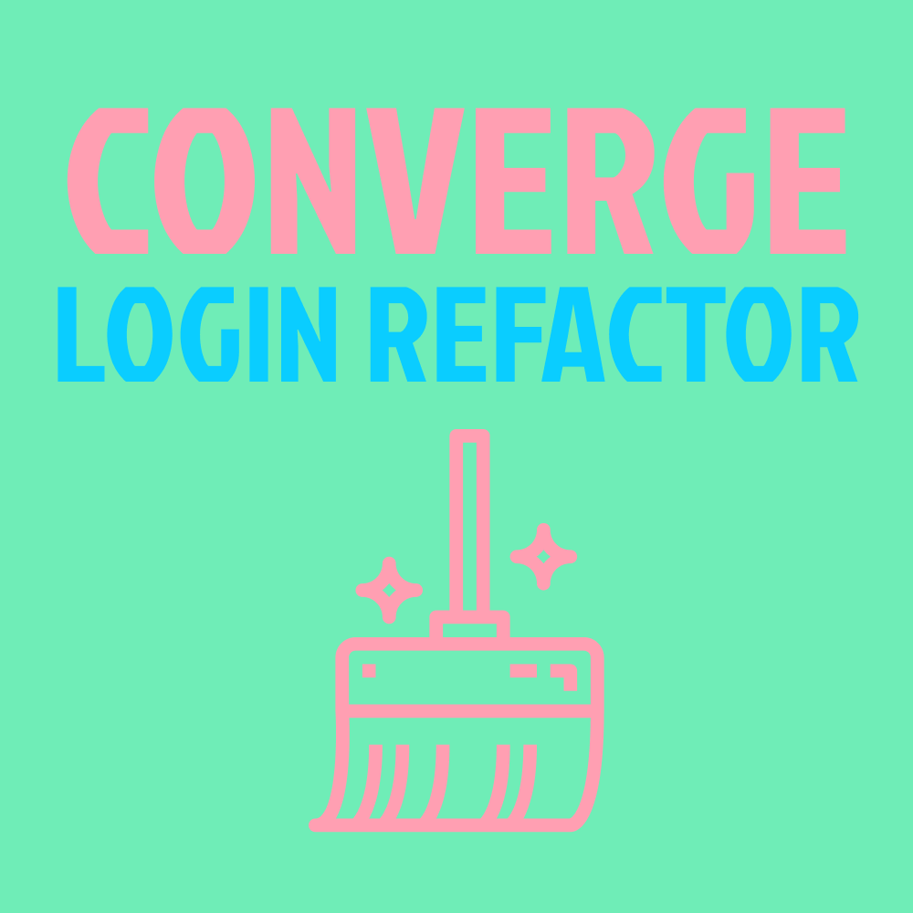

# Login Refactor

This repository ~~has~~ will have a [Next.js](https://nextjs.org) [React](https://reactjs.org) application that has a dashboard protected by a login.

The challenge, should you accept, is to refactor the `<LoginPage />` component into subcomponents to make it easier to maintain and add features to later. You'll be paired with your interviewer to accomplish this challenge together in collaboration in under 60 minutes.

## Agenda

It may be helpful to follow an outline similar to this one:

1. Whiteboarding - strategize the approach to subdividing the `<LoginPage />` component (10 minutes)
2. Pair programming - use screenshare or a dedicated tool like CodeSandbox, CodePair, or CoderPad to work together to accomplish the refactor (40 minutes)
3. Retrospective review - file a merge request, and review the code together to assess the strengths and weaknesses of the work accomplished (10 minutes)
